> **RpiZero2W als YouTube Headlesstreamer**

Der Grund diesen Tutorials ist das mit einem Raspberry Pi Zero2W allein
als Streamer die Zuschauer qualitativ auf Einen begrenzt sind. Mit einem
YouTube- Kanal lässt sich die Anzahl an Zuschauern erhöhen und deren
Management ist mittels des YouTube-Webinterfaces recht komfortabel.

Es wird beschrieben wie Ihr einen YouTube-Account anlegt und einen
Raspberry Pi Zero2W mit angeschlossenem csi- Kameramodul als
konfigurationsfreie YT-Kamera nutzten könnt. Nach dem Anlegen des
YT-Accounts müsst Ihr 24 Stunden Warten bis Ihr diesen zum streamen
nutzen könnt, deshalb solltet Ihr gleich damit beginnen

> **Vorraussetzungen**
>
> • Eine gültige gmail-Mailadresse
>
> • Ein Handy für die Bestätigungs-SMS
>
> • Internetzugang/Browser
>
> • Einen RPiZero2W mit RaspiosOS Bookworm und ssh- oder Terminallogin
>
> • Ein bereits mittels csi-Aschlusskabel dem RPiZero2W korrekt
> verbundenes Kameramodul
>
> **Vorgehensweise**
>
> Zuerst legen wir ein YouTube- Account und Kanal an,
>
> dann warten wir 24 Stunden,
>
> um im Anschluss einen Livestream im bereits angelegten Kanal zu
> erstellen
>
> damit wir den Installations- und Konfigurationsprozess auf dem Raspi
> starten,
>
> und dann das Livebild des Kameramoduls zu sehen und im Kanal nach
> belieben veröffentlichen.
>
> **YouTube- Account und Kanal anlegen**

Wir öffnen unserer Browser und geben in dessen Sucheingabe die
Internetadresse youtube.com ein,

> und klicken wie im Bild unten magentafarben markiert zu sehen ist auf
> „Sign in"

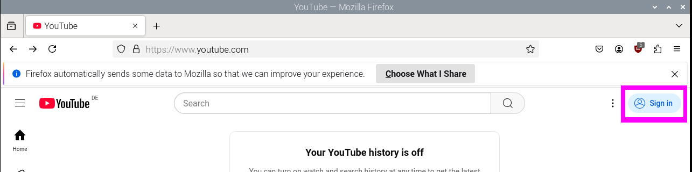

> Damit wir hier unsere gültige E-Mail und darauf folgend deren
> Paasswort eingeben

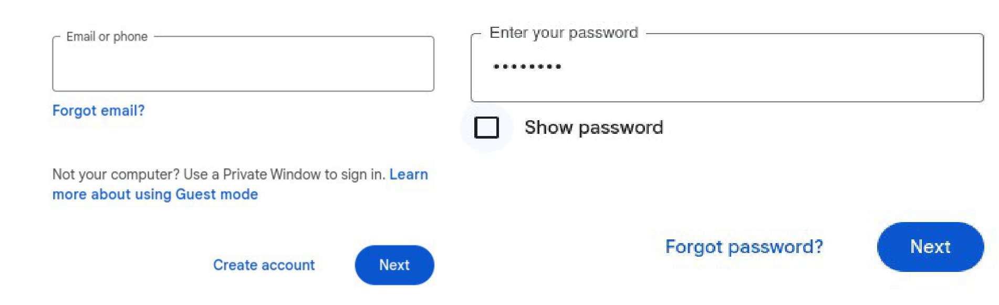{width="6.602777777777778in"
height="2.013888888888889in"}

> 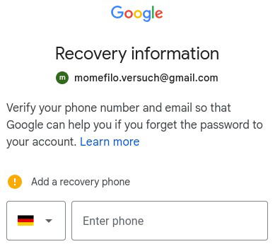{width="2.3208333333333333in"
> height="2.0236100174978127in"}
>
> Hier genügt es unsere Handynummer einzugeben und den Dialog zu
> bestätigen.
>
> 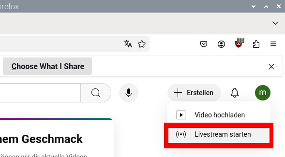{width="3.4402777777777778in"
> height="1.8986100174978127in"}
> 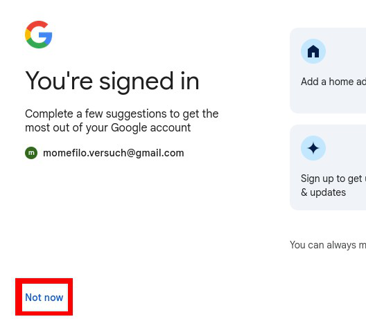{width="2.8180555555555555in"
> height="2.5055544619422574in"}

Und dann wie im rechten Bild auf den rot markierten „not

> now" Button klicken um, wie im Unteren Bild rot
>
> markiertzu sehen, auf „Livestream starten" klicken

Den darauf folgend, unten links abgebildeten Dialog bestätigen wir
einfach mit „Kanal erstellen"

> 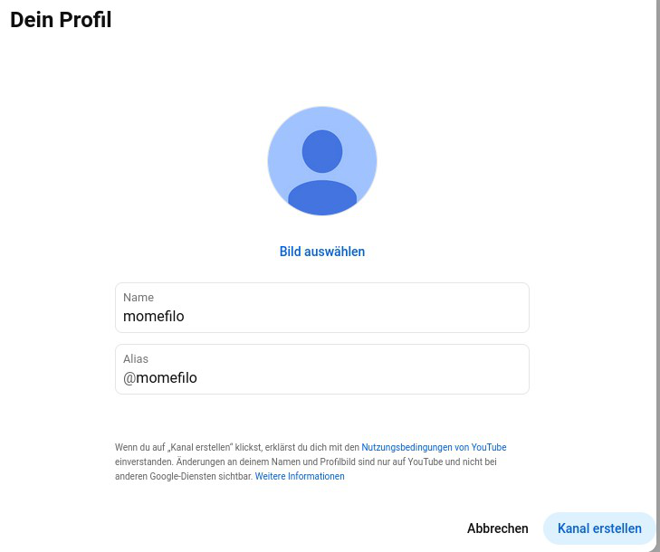{width="2.973611111111111in"
> height="2.488888888888889in"}
>
> {width="3.058333333333333in"
> height="1.2152777777777777in"}
>
> 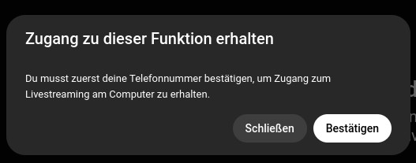{width="3.0819433508311462in"
> height="1.211111111111111in"}

Damit wir eine Anfrage zum Livestreamen durch klick stellen und
bestätigen.

In einem neu erscheinenden Fenster geben wir unsere Telefonmmer ein und
erhalten unmittelbar einen Code auf unser Handy gsendet, den wir im
nächsten Dialog eingeben und ebenfalls bestätigen

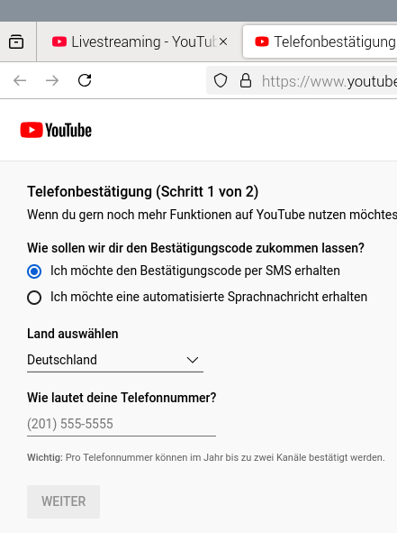{width="2.6819444444444445in"
height="3.5944444444444446in"}

> 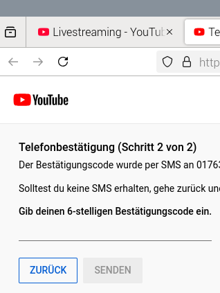{width="2.638888888888889in"
> height="3.511111111111111in"}
>
> *Bilder: Heute letzter schritt, die Telefoncode-Bestetigung*
>
> Nun warten wir 24 Stunden
>
> 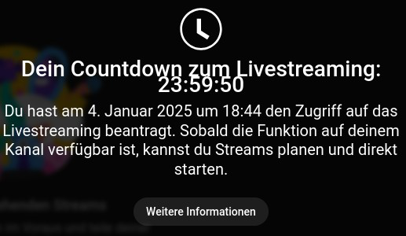{width="4.223611111111111in"
> height="2.4513877952755907in"}
>
> **YouTube-Benutzerkonto-konfiguration**
>
> Wir navigieren mit einem Browser zu unserem Yutubekonto unter der
> Adresse\
> „" und starten mit zwei klicks, wie im Bild markiert zu sehen den
> Einstiegsdialog zur Livestreamkonfiguration.

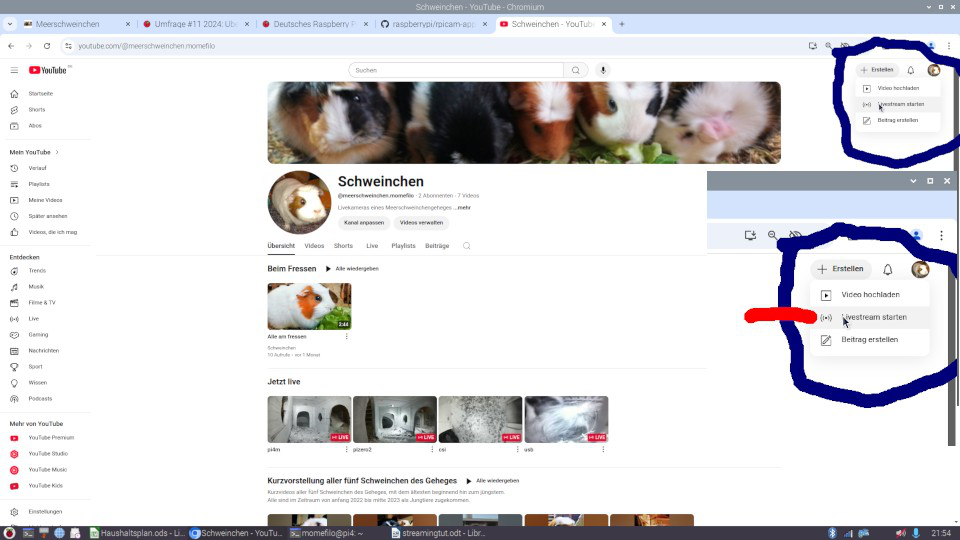{width="6.6930555555555555in"
height="3.0166666666666666in"}

> Sollte der Dialog nicht automatisch starten muss man im rot Markierten
> Bereich des unteren Bildes auf „Stream planen" klicken

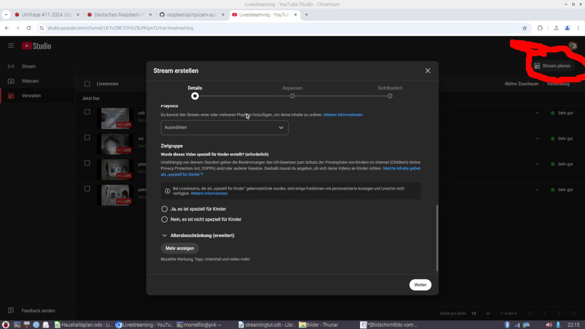{width="6.6930555555555555in"
height="3.765277777777778in"}

> In diesem Dialog werden selbsterklärende Dinge erfragt dies sich nach
> dessen Abschluss noch vor dem Start des Streams, und viele auch danach
> noch bearbeiten lassen. Wie z.B. die Option den Stream auch
> eingebettet in Internetseiten wiederzugeben, welche beim Start
> unabhängig ihrer Auswahl jetzt, immer deaktiviert ist und danach
> geändert werden kann.
>
> Wenn wir mit diesem Dialog fertig sind gelangen wir zu dem uns
> wichtigen Teil der Konfiguration in dem wir die Zieladresse des
> Streams erfahren. **Wir benötigen nur den rot markierten Teil und
> Kopieren uns den in ein Textdokument**

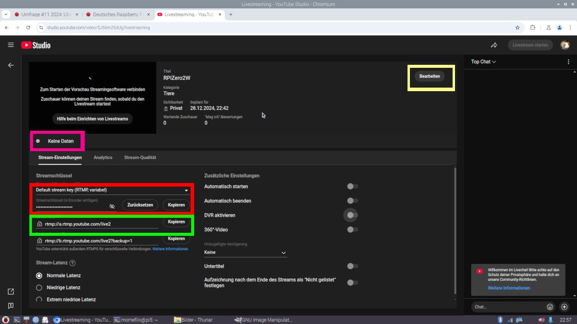{width="6.6930555555555555in"
height="3.763888888888889in"}

> Der magentafarben markierte Punkt zeigt uns uns in vier Stufen bis zu
> „sehr gute Qualität" an das wir keine Daten senden. Gelb markiert die
> Möglichkeit jene Einstellungen des Einstiegsdialoges zu bearbeiten.
> Interessant zu wissen das die Latenz nach dem Start des Streams nicht
> mehr geändert werden kann.
>
> Das lassen wir nun einfach so wie es ist denn das benötigen gleich
> wieder zur Übrtprüfung, und wenden uns dem Terminal zu, das uns mit
> blinkendem Cursor die Bereitschaft des RPiZero2W zur Befehlseingabe
> signalisiert
>
> **Installation/Konfiguration auf dem Raspi Starten**
>
> Zunächst allgemein, die bereits Vorinstallierte Software rpicam-vid
> führt die Sensordaten des Kameramoduls über einen Teilbereich des
> Prozessors, welcher besonders geeignet ist Datenströme in Echtzeit zu
> bearbeiten. Wir werden anweisen den Datenstrom in das etablierte
> Format h264, welches unserem zu vor konfiguriertem
> YouTube-Streamingdienst genügt um zuwandeln. Den umgewandelten
> Datenstrom leiten wir an die von uns installierte Software ffmpeg
> weiter, welche diesem einen Audiodatenstrom hinzufügt der für das
> Streamen über YouTube unerlässlich ist. Der Einfachheit wegen ist
> dieser stumm, kann aber ebenso einfach durch eigene Recherche ersetzt
> werden. Auch das Senden des Streams über das Internet mittels RTMP,
> ein Echtzeitnachrichten Protokoll erledigt ffmpeg. Die Software
> rpicam-vid und ffmpeg wird durch Aufruf einer\
> Befehlszeile in einer ausführbaren Datei mit dem Systemdienst systemd
> zur Ausführung gebracht, mit dessen Konfiguration wir nun beginnen
>
> ***Gerätedatei ermitteln***
>
> Um zu wissen das unsere Kamera als solche vom System erkannt ist,
> schauen wir zunächst in dessen Gräteverzeichnis nach Einträgen der
> Form „videoX", wobei das X für eine beginnend von 0 fortlaufenden
> Ziffer steht die jeweils einem erkanntem Videogerät zugewiesen wird;
> Wichtig ist zu wissen das manche Kameras zwei videoX Gerätedateien
> zugewisen wird von denen die erste immer den Videodatestrom führt. Ist
> nebem dem csi-Kameramodul z.B. noch eine USB-Kamera\
> angeschlossen, so erzeugt die eingabe folgendes Befehls in die
> Eingabeaufforderung des Terminals
>
> ls -l /dev/video\*
>
> folgende Ausgabe

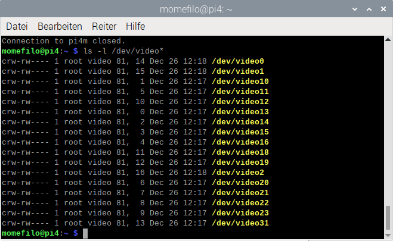{width="6.6930555555555555in"
height="4.113888888888889in"}

> Um nun zu ermitteln welche der Gerätedateien dem csi-Kameramodul
> zugewisen ist, müssen wir nacheinander die Gerätedateien /dev/video0
> bis /dev/video2 genauer untersuchen. Denn eine unbewiesene Annahme
> sagt das Videogerätedateien mit zwei Ziffern keine extern
> angeschlossenen Videogeräte darstellen. Mit dem bereits
> vorinstallierten Programm v4l2-ctl lässt sich eine solche Überprüfung
> leicht durchführen in dem man die Videogerätedatei beim Programmaufruf
> als Parameter mit übergibt.
>
> So überprüfen wir das Gerät /dev/video0 mit folgendem Programmaufruf
> in der Eingabeaufforderung des Terminals
>
> v4l2-ctl -d /dev/video0 -D
>
> Beispielhaft erscheint folgende Bildschirmausgabe

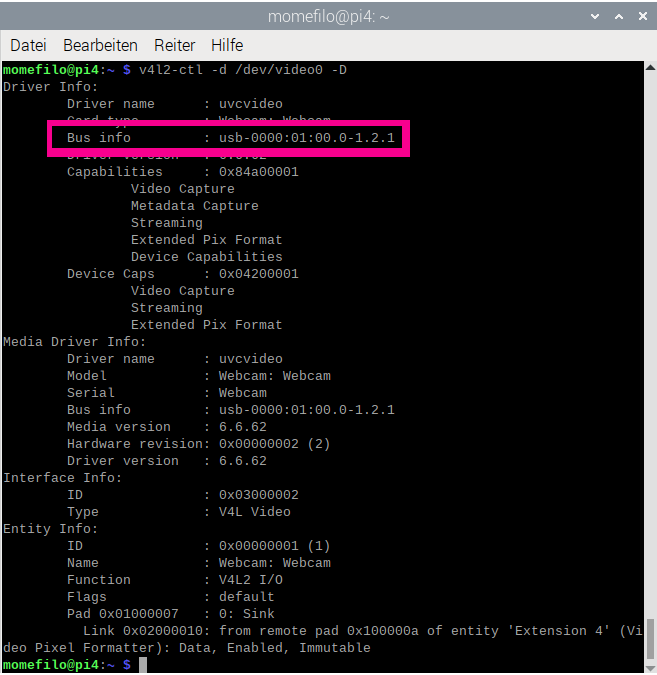{width="6.6930555555555555in"
height="6.876388888888889in"}

> Welche im magetafarben markierten Bereich zeigt das es sich hier um
> die USB-Cam handeln muss. Das Komando
>
> v4l2-ctl -d /dev/video1 -D
>
> zeigte bei mir auch ein USB-Gerät was darauf schließen lässt das die
> USB-Cam zwei Gerätedateien belegt. Erst der Aufruf
>
> v4l2-ctl -d /dev/video2 -D
>
> offenbarte folgendes

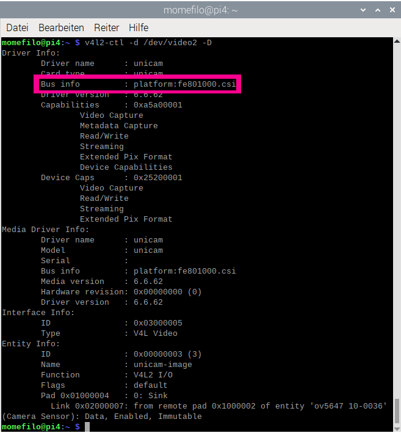{width="6.6930555555555555in"
height="5.998611111111111in"}

> und im markierten Bereich die Gerätedatei als dem csi-Kameramodul
> zugewiesen zeigt.
>
> Wichtig:Wenn nur ein Videogerät/Kamera am RPiZero2W angeschlossen ist,
> ist die zugewisene Gerätedatei immer /dev/video0. Wir benötigen nur
> die tatsächliche Ziffer
>
> **Installation/Konfiguration auf den Raspi starten.**
>
> Das script erwartet als ersten parameter die DeviceID der cam, also
> bei einer Cam 0, und als zweiten den im Textdokument kopierten
> Streamschlüssel
>
> Wir geben folgende befehle nach einander ein:
>
> wget raw.githubusercontent.com/momefilo/streaming/refs/heads/main/install.sh\
> chmod +x install.sh\
> sudo ./install.sh meine_DeviceID mein_streamkey\
>
> Nun warten wir bis der RPi rebootet, gehen zu Youtube zurück und
> schauen und warten noch mal eine Minute. Da ist das Bild! Nun könnt Ihr nach
> belieben konfigurieren. Mit nicht langsamen SD-Karten dauert der
> Vorgang ca. fünf Minuten. Sollten Ihr eine Minute nach dem Reebot
> nicht im YT-Interface sehen wenden Euch sich an
> https://forum-raspberrypi.de/

**Hinweis**\
Im install.sh Script kann die Zeile 39 aukommentiert werden und eine der
drei Darunterliegenden aktiviert werden für NoIr-Cams mit ov5647Sensor,
USB-Cams, und USB-Cams an Intel-Maschinen
